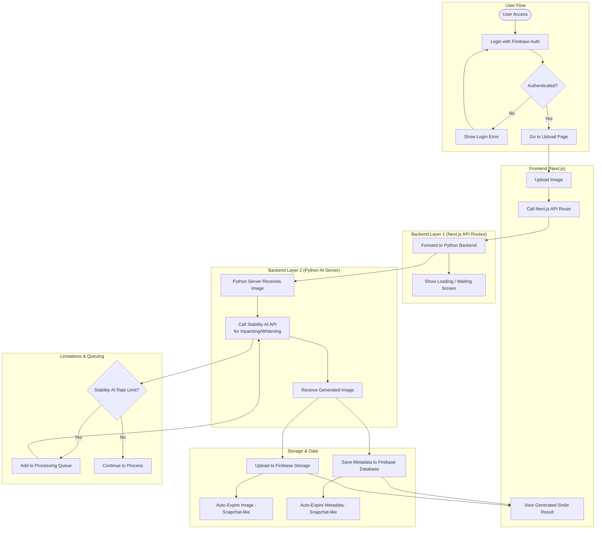

---

### 📌 What’s Represented: (Technical Version):

- User logs in using Firebase Authentication
- Uploads an image through the Next.js frontend
- Next.js backend sends the image to a Python backend
- Python backend processes the image using Stability AI (for smile enhancement or whitening)
- The resulting image is uploaded to Firebase Storage
- Metadata (like user info and timestamps) is saved in Firebase Database
- Both image and metadata are auto-expired after a period (Snapchat-style)
- If Stability AI's rate limit is reached, the image request is placed in a processing queue

### 📌 What’s Represented (Non-Technical Version):

- A person visits the website and logs in with their email
- They upload a photo of themselves to see how they’d look with a better smile
- The website sends the photo to a system that edits their smile using advanced AI
- Once finished, the new photo is saved securely in the cloud
- Info like when the photo was created and who uploaded it is also saved
- Just like Snapchat, the photo and info will disappear after a while to keep things private
- If too many people use the AI at the same time, the system puts them in a waiting line so everyone gets their turn

